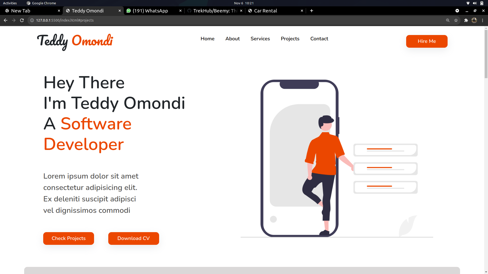

<link
      rel="stylesheet"
      href="https://cdnjs.cloudflare.com/ajax/libs/font-awesome/6.0.0-beta2/css/all.min.css"
      integrity="sha512-YWzhKL2whUzgiheMoBFwW8CKV4qpHQAEuvilg9FAn5VJUDwKZZxkJNuGM4XkWuk94WCrrwslk8yWNGmY1EduTA=="
      crossorigin="anonymous"
      referrerpolicy="no-referrer"
    />

<div style="text-align: center; ">
        <div>
            <h1>Hi There, I'm <span style="color: green; ">Teddy Omondi</span> <span style='font-size:50px;'> &#128075</span></h1>
            <h3>Upcoming Junior Software Developer &#128187; &#127911;</h3>
        </div>
        
</div>
<br>

# My Portfolio <span style='font-size:30px;'>&#128104;</span> 

This is my Portfolio Website where I showcase some of the projects I've been working on and also talk more about myself

<br>

<!-- # The Design <span style='font-size:30px;'>&#128293;</span>

<br>


<br> -->

# Demo &#128273;

Here is a live link to the project 


https://trekhub.github.io/myPortfolio/



# Usage <span style='font-size:30px;'>🖋</span> 
If you want to view the code or change some elements on the website, you are welcomed to clone the project

``` git
git clone git@github.com:TrekHub/myPortfolio.git

```


# Technology Used <span style='font-size:30px;'>&#128187;</span> 

1. Html  <i class="fa-brands fa-html5"></i>

2. CSS  <i class="fa-brands fa-css3"></i>


# Author <span style='font-size:30px;'>&#128524;</span> 

Teddy Omondi 

# License  <span style='font-size:30px;'>🔐</span> 
[MIT](https://choosealicense.com/licenses/mit/)